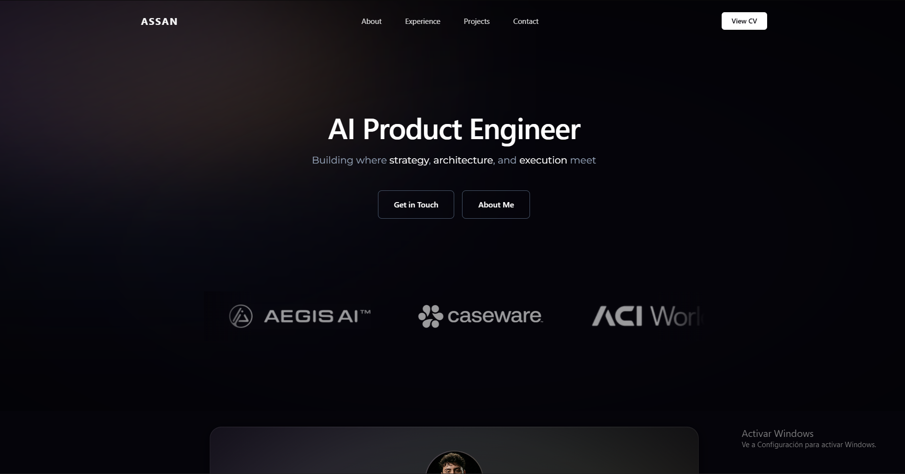

# Personal Portfolio v2

A dark, modern personal portfolio built with Next.js, TypeScript, and CSS.



## Tech Stack

- **Framework:** Next.js 14 (App Router)
- **Language:** TypeScript
- **Styling:** CSS (BEM naming) + Tailwind CSS

## Sections

- **Hero** -- Landing with navigation and CTA buttons
- **About** -- Profile card with skills and bio
- **Experience** -- 4 work entries as paired cards (company + role) with brand-colored gradients, breathing animations, and rotating border effects

## Getting Started

```bash
# Install dependencies
npm install

# Run dev server (port 4000)
npm run dev

# Build for production
npm run build
```

## Preview Routes

- `/` -- Main portfolio page
- `/preview` -- Experimental page for testing new features and designs
